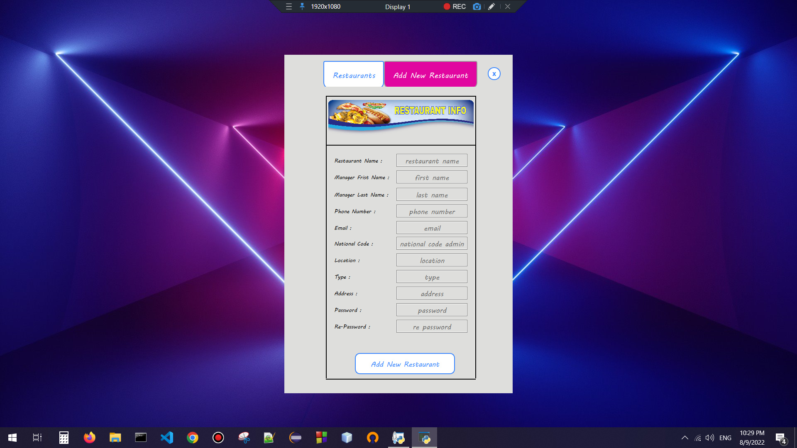
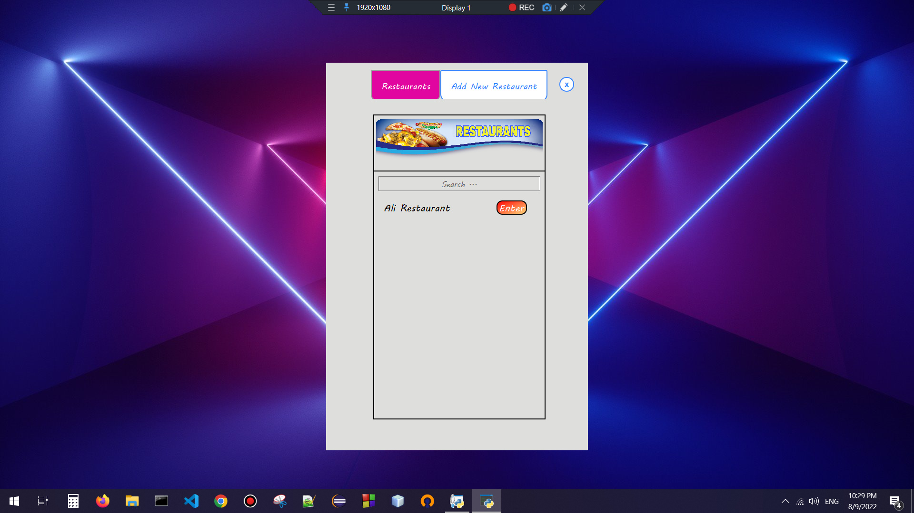
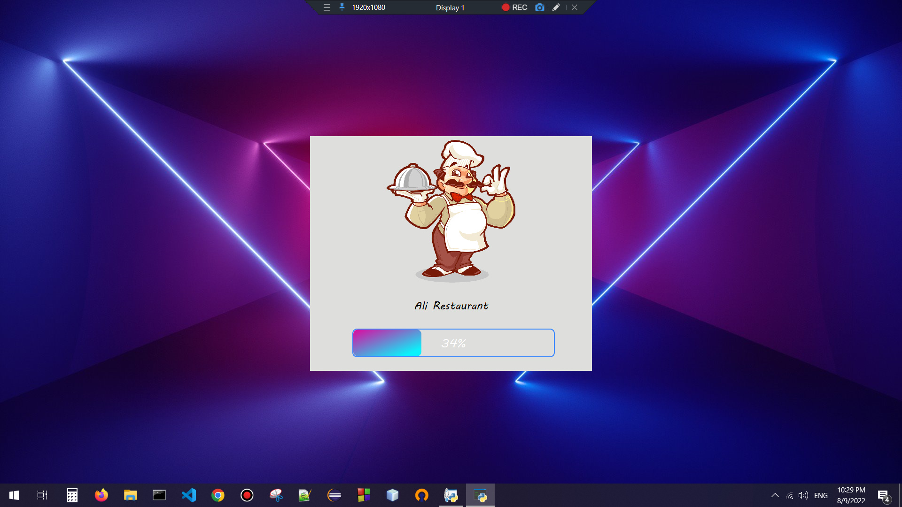
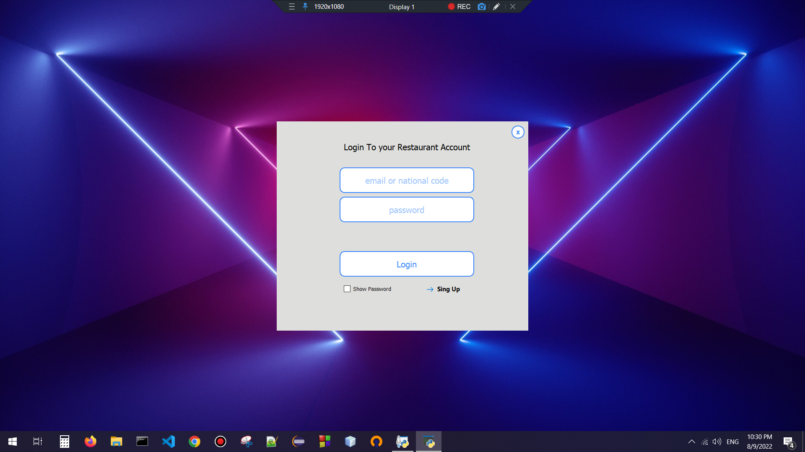
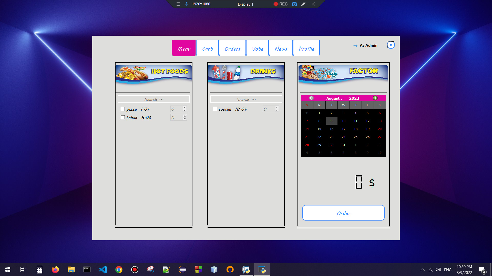
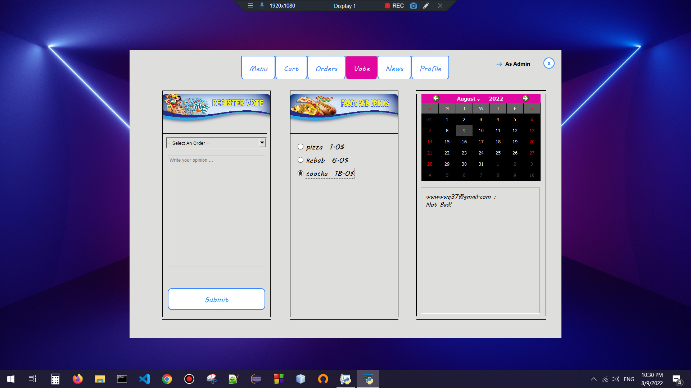
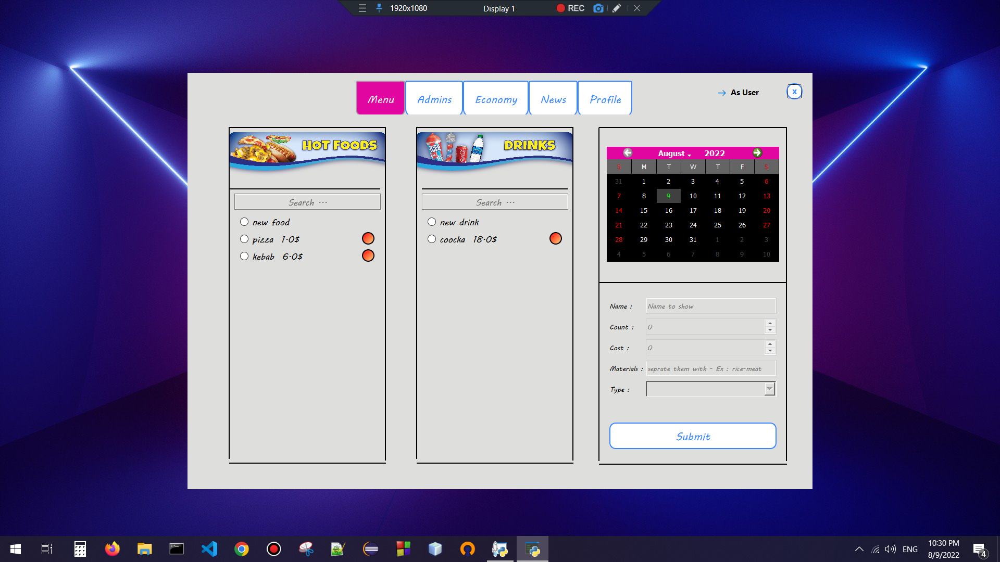
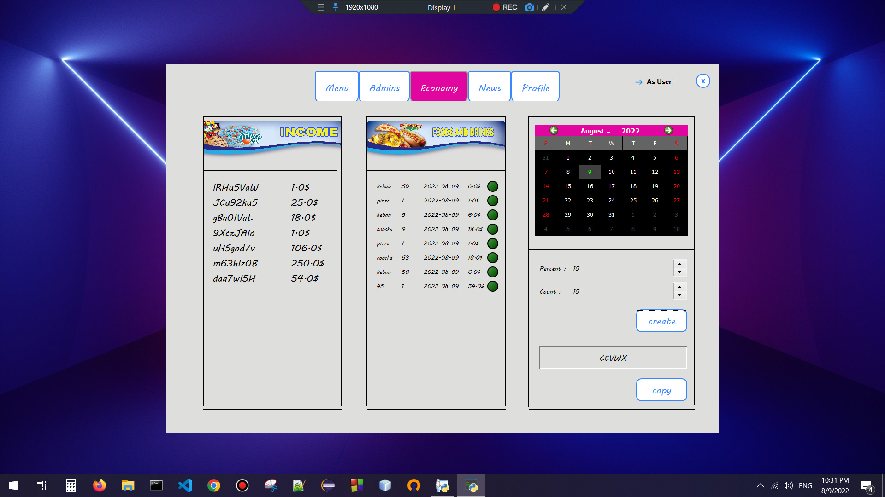

# Restaurant management with graphical interface

_This is a multiple restaurant management project built graphical interface with the pyqt5 library._

<br>

# Starting 🚀

_These instructions allow you to get a copy of the running project on your local machine._

## Pre-requisites 📋
_You need to have a 3.X version of Python_

## Installation 🔧

- Make a git clone or download it in zip
```bash
git clone https://github.com/irania9O/Restaurant.git
```
- Get in the directory
- Install from your terminal with pip requirements.txt:

```bash
pip install -r requirements.txt
```
<br>

# Run the main 🧮:

```bash
python main.py
```
<br>

# Ideas 💡:

- It can be connected to a online database and be an online restaurant management system.
- Images for food and restaurants can be added.

<br>

# Screenshots








